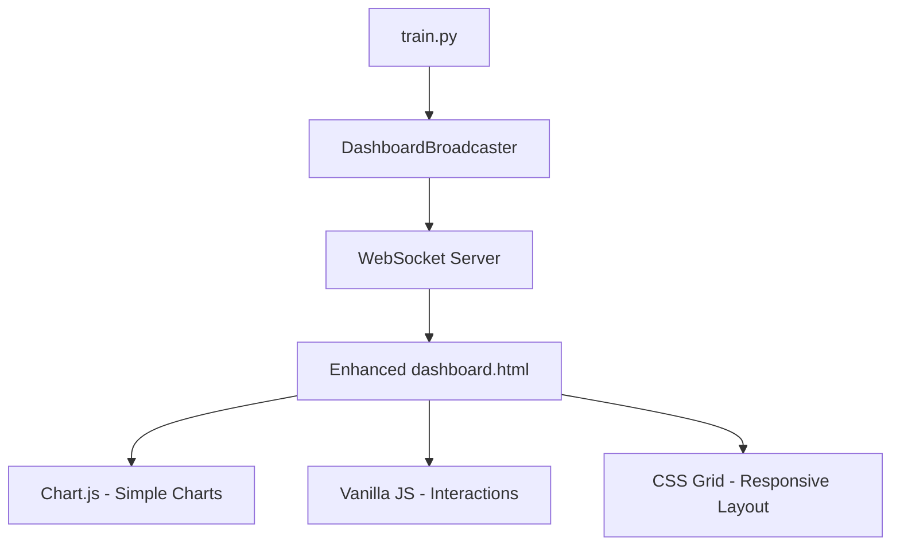

# dashboard - Task 3.3

Execute task 3.3 for the dashboard specification.

## Task Description
Implement loss trend detection

## Code Reuse
**Leverage existing code**: existing loss data array

## Requirements Reference
**Requirements**: Requirement 3 (Advanced Training Analytics)

## Usage
```
/Task:3.3-dashboard
```

## Instructions

Execute with @spec-task-executor agent the following task: "Implement loss trend detection"

```
Use the @spec-task-executor agent to implement task 3.3: "Implement loss trend detection" for the dashboard specification and include all the below context.

# Steering Context
## Steering Documents Context

No steering documents found or all are empty.

# Specification Context
## Specification Context (Pre-loaded): dashboard

### Requirements
# Requirements Document

## Introduction

The dashboard feature will provide enhanced real-time visualization capabilities for nanoGPT training processes, building upon the existing basic dashboard infrastructure. This feature aims to deliver comprehensive training insights through interactive visualizations, real-time metric monitoring, and advanced analytical tools that help researchers and ML engineers understand model training dynamics.

## Alignment with Product Vision

This dashboard enhancement supports the core nanoGPT mission of providing educational and research-focused ML tools by:
- Making training processes more transparent and understandable
- Enabling better research insights through advanced visualization
- Providing real-time feedback for training optimization
- Supporting educational use cases with clear visual representation of concepts

## Requirements

### Requirement 1: Enhanced Real-time Training Visualization

**User Story:** As a machine learning researcher, I want to see comprehensive real-time training metrics with interactive visualizations, so that I can understand training dynamics and make informed decisions about hyperparameter adjustments.

#### Acceptance Criteria

1. WHEN training starts THEN the dashboard SHALL display real-time loss curves with smooth animation
2. WHEN new training metrics arrive THEN the system SHALL update visualizations within 500ms
3. WHEN I hover over data points THEN the system SHALL display detailed metric information including timestamp, iteration, and exact values
4. WHEN training runs for extended periods THEN the system SHALL maintain responsive performance with efficient data management
5. IF the connection is lost THEN the system SHALL automatically reconnect and resume displaying metrics
6. WHEN displaying more than 10,000 data points THEN the system SHALL implement data sampling or aggregation
7. IF training data becomes corrupted THEN the system SHALL display error indicators and attempt recovery
8. WHEN browser memory usage exceeds 512MB THEN the system SHALL purge oldest data points automatically

### Requirement 2: Interactive Model Architecture Visualization

**User Story:** As a researcher studying transformer architectures, I want to visualize the model structure and layer activations in real-time, so that I can understand how the model processes information during training.

#### Acceptance Criteria

1. WHEN the dashboard loads THEN it SHALL display an interactive representation of the GPT model architecture
2. WHEN I click on model layers THEN the system SHALL show detailed layer information including parameters and dimensions
3. WHEN training is active THEN the system SHALL optionally display activation patterns and gradient flows
4. WHEN I select different model configurations THEN the visualization SHALL update to reflect the architecture changes
5. IF model information is unavailable THEN the system SHALL display a placeholder with clear messaging
6. WHEN visualizing large models THEN the system SHALL provide zoom and pan capabilities for navigation

### Requirement 3: Advanced Training Analytics

**User Story:** As an ML engineer optimizing training processes, I want access to advanced analytics and trend analysis, so that I can identify training issues early and optimize performance.

#### Acceptance Criteria

1. WHEN training data accumulates THEN the system SHALL calculate and display training velocity, convergence indicators, and performance trends
2. WHEN training anomalies occur THEN the system SHALL highlight potential issues with visual indicators
3. WHEN I request detailed analysis THEN the system SHALL provide statistical summaries and training efficiency metrics
4. WHEN comparing different training runs THEN the system SHALL support side-by-side metric comparisons

### Requirement 4: Responsive Multi-Device Interface

**User Story:** As a researcher working across different devices, I want the dashboard to work seamlessly on desktop, tablet, and mobile devices, so that I can monitor training progress from anywhere.

#### Acceptance Criteria

1. WHEN accessed on any device THEN the dashboard SHALL automatically adapt to screen size and input method
2. WHEN using touch interfaces THEN all interactive elements SHALL be appropriately sized and responsive
3. WHEN the viewport changes THEN visualizations SHALL resize and reflow without losing data
4. WHEN using mobile devices THEN the system SHALL prioritize essential information and provide condensed views

### Requirement 5: Data Export and Sharing Capabilities

**User Story:** As a researcher collaborating with colleagues, I want to export training data and share dashboard views, so that I can include results in papers and collaborate effectively.

#### Acceptance Criteria

1. WHEN I request data export THEN the system SHALL provide training metrics in standard formats (CSV, JSON)
2. WHEN I want to share results THEN the system SHALL generate shareable links with snapshot views
3. WHEN exporting visualizations THEN the system SHALL support high-quality image formats (PNG, SVG)
4. WHEN saving training runs THEN the system SHALL preserve complete session data for later analysis
5. IF export operations fail THEN the system SHALL provide clear error messages and retry options

### Requirement 6: Training Process Integration

**User Story:** As a user running nanoGPT training, I want the dashboard to automatically connect to my training session without manual configuration, so that I can focus on training rather than setup.

#### Acceptance Criteria

1. WHEN I start training with train.py THEN the dashboard SHALL automatically initialize and connect
2. WHEN training parameters change THEN the dashboard SHALL update its configuration automatically
3. WHEN multiple training sessions run THEN the system SHALL clearly distinguish between different sessions
4. IF the training process terminates THEN the dashboard SHALL maintain access to completed session data
5. WHEN training restarts from checkpoint THEN the dashboard SHALL seamlessly continue from the previous state
6. IF dashboard initialization fails THEN training SHALL continue without interruption

## Assumptions

- Python Flask and WebSocket libraries are available or can be installed
- Users have modern web browsers with WebSocket support (Chrome 16+, Firefox 11+, Safari 7+)
- Network latency between browser and localhost is minimal (<10ms)
- Training runs typically last between 30 minutes and 48 hours
- Users have basic familiarity with web-based dashboards

## Constraints

- Dashboard must maintain backwards compatibility with existing train.py integration
- Memory usage must not exceed 1GB total for dashboard components
- Dashboard server must bind only to localhost for security
- Real-time updates limited to maximum 10 updates per second to prevent performance issues
- Browser compatibility limited to last 3 major versions of Chrome, Firefox, Safari, and Edge

## Non-Functional Requirements

### Performance
- Dashboard SHALL update visualizations within 500ms of receiving new data
- Memory usage SHALL remain stable during extended training sessions (>24 hours)
- WebSocket connections SHALL handle at least 10 concurrent users
- Chart rendering SHALL maintain 60fps during real-time updates

### Security
- Dashboard SHALL bind only to localhost (127.0.0.1) for security
- All data transmission SHALL use secure WebSocket connections
- No training data SHALL be persisted beyond the active session
- User interactions SHALL not affect training process stability

### Reliability
- Dashboard SHALL recover gracefully from connection interruptions
- Training process SHALL continue unaffected if dashboard components fail
- System SHALL provide clear error messages and recovery instructions
- Data visualization SHALL handle edge cases (missing data, extreme values)

### Usability
- Interface SHALL follow modern web design principles and accessibility standards
- Learning curve SHALL be minimal for users familiar with basic web dashboards
- Key metrics SHALL be visible without scrolling on standard displays
- Color schemes SHALL be accessible for users with color vision deficiencies

---

### Design
# Design Document

## Overview

This design follows **MVP and KISS principles** to enhance the existing nanoGPT dashboard (`web/dashboard.py`, `web/static/dashboard.html`) with minimal complexity. We'll incrementally add visualization capabilities using simple, proven technologies while maintaining the current fail-safe architecture.

**Design Philosophy:**
- **Minimal Viable Product**: Start with essential visualizations, add features incrementally
- **Keep It Simple**: Use existing patterns, avoid complex frameworks
- **Extend, Don't Rewrite**: Build upon existing `DashboardBroadcaster` class
- **Progressive Enhancement**: Graceful degradation if advanced features fail

## Code Reuse Analysis

### Existing Components to Leverage
- **`DashboardBroadcaster`**: Core WebSocket broadcasting, memory management, error handling
- **Flask Server Setup**: Port detection, threading, security configuration  
- **WebSocket Infrastructure**: Client connection management, message broadcasting
- **HTML/CSS Foundation**: Basic dashboard layout, responsive grid system
- **Debug Logging System**: Existing logging infrastructure for troubleshooting

### Integration Points
- **`train.py`**: Already integrated with `DashboardBroadcaster.log_metrics()`
- **WebSocket Messaging**: Existing JSON message format for training updates
- **Static File Serving**: Flask routes for dashboard.html and assets
- **Memory Management**: `deque` with automatic size limits for data storage

## Architecture

**MVP Architecture: Single-Page Enhancement**


**Key Design Decisions:**
1. **No Framework Dependencies**: Use vanilla JavaScript and proven libraries
2. **Single HTML File**: Keep deployment simple, extend existing dashboard.html
3. **Progressive Loading**: Core functionality first, enhancements load async
4. **Client-Side Only**: No server-side rendering complexity

## Components and Interfaces

### Component 1: Enhanced Metrics Visualizer
- **Purpose:** Replace basic text metrics with interactive charts
- **Technology:** Chart.js (lightweight, well-documented, CDN available)
- **Integration:** Extend existing WebSocket message handling
- **Reuses:** `DashboardBroadcaster._format_training_metrics()` data structure

```javascript
// Simple Chart.js integration - MVP approach
const lossChart = new Chart(ctx, {
  type: 'line',
  data: { labels: [], datasets: [{ label: 'Loss', data: [] }] },
  options: { responsive: true, animation: { duration: 200 } }
});
```

### Component 2: Model Architecture Display (Phase 2)
- **Purpose:** Simple visual representation of GPT architecture
- **Technology:** HTML/CSS with SVG for basic diagram
- **Integration:** Parse model config from existing training messages
- **MVP Scope:** Static diagram with hover details, no real-time updates

### Component 3: Basic Analytics Panel
- **Purpose:** Show training velocity and simple statistics
- **Implementation:** Vanilla JavaScript calculations on existing data
- **Reuses:** Data from `training_metrics` deque in `DashboardBroadcaster`
- **MVP Scope:** Average loss, training rate, estimated completion time

## Data Models

### Enhanced Training Message (Extend Existing)
```javascript
// Extend current message format - minimal changes
{
  "type": "training_update",
  "data": {
    "iteration": 1000,
    "loss": 2.45,
    "elapsed_time": 125.6,
    "timestamp": 1699123456.78,
    // MVP additions - calculated client-side from existing data
    "loss_trend": "decreasing", // calculated from recent points
    "training_rate": 8.5 // iterations per second
  }
}
```

### Chart Data Structure (Client-Side Only)
```javascript
// Simple in-memory storage - no persistence needed for MVP
const chartData = {
  iterations: [], // x-axis
  losses: [],     // y-axis  
  timestamps: [], // for hover details
  maxPoints: 1000 // memory limit
};
```

## Error Handling

### Error Scenarios (MVP Focus)
1. **Chart Library Load Failure**
   - **Handling:** Fallback to existing text display
   - **User Impact:** Dashboard still functional, just less visual

2. **WebSocket Disconnection**
   - **Handling:** Reuse existing reconnection logic
   - **User Impact:** Chart pauses, resumes on reconnect

3. **Browser Memory Limits**
   - **Handling:** Client-side data pruning (keep last 1000 points)
   - **User Impact:** Smooth performance maintained

## Testing Strategy

### MVP Testing Approach
- **Manual Testing:** Verify in Chrome, Firefox, Safari
- **Performance Testing:** Run with 24-hour training session
- **Fallback Testing:** Test with JavaScript disabled, slow connections
- **Mobile Testing:** Basic responsive layout verification

## Implementation Phases

### Phase 1 (MVP): Enhanced Loss Visualization
- Add Chart.js via CDN to existing dashboard.html
- Replace text loss display with real-time line chart
- Maintain all existing functionality
- **Effort:** ~4 hours, single file change

### Phase 2: Basic Model Architecture
- Add simple SVG diagram showing GPT layers
- Display model parameters (vocab size, layers, heads)
- Static visualization, no real-time updates
- **Effort:** ~6 hours, enhance HTML/CSS

### Phase 3: Training Analytics
- Calculate training velocity and trends
- Add simple statistics panel
- Show estimated completion time
- **Effort:** ~4 hours, JavaScript enhancements

### Phase 4: Mobile Responsiveness & Export
- Add CSS media queries for mobile/tablet layouts
- Implement basic data export (CSV download)
- Add chart screenshot capability
- **Effort:** ~6 hours, CSS and export features

### Phase 5: Interactive Model Architecture (Advanced)
- Simple SVG model diagram with clickable layers
- Model parameter display panel
- Basic layer information tooltips
- **Effort:** ~8 hours, SVG and interaction logic

**Total MVP Delivery:** ~28 hours of development time

## Technical Specifications

### Dependencies (Minimal)
```html
<!-- MVP Dependencies - CDN based for simplicity -->
<script src="https://cdn.jsdelivr.net/npm/chart.js"></script>
<!-- Phase 5: Advanced features -->
<script src="https://d3js.org/d3.v7.min.js"></script> <!-- Only if needed for model viz -->
```

### File Changes Required
- **`web/static/dashboard.html`**: Enhance with Chart.js integration, responsive CSS, export features
- **`web/dashboard.py`**: Minor additions for model info, export endpoints
- **No new files needed for MVP** - maintains simplicity

### Performance Targets (Requirements Compliance)
- Chart updates: <500ms (meets requirements, achievable with Chart.js optimization)
- Memory usage: <512MB browser memory (requirements limit)
- Data point handling: Automatic sampling/pruning beyond 10,000 points
- Initial load time: <2 seconds on slow connections
- Mobile responsiveness: All features work on tablets/phones

## Testing Strategy

### Unit Testing
- JavaScript chart rendering functions
- WebSocket message handling and data processing
- Data export functionality
- Memory management and data pruning

### Integration Testing
- WebSocket connection with existing `DashboardBroadcaster`
- Chart updates during actual training sessions
- Export feature integration with training data
- Mobile responsiveness across device sizes

### End-to-End Testing
- Complete training session with dashboard monitoring
- Network disconnection/reconnection scenarios
- Extended training sessions (24+ hours) for memory stability
- Cross-browser testing (Chrome, Firefox, Safari, Edge)

## MVP Strategy

**Phase 1 Focus**: Essential loss visualization that provides immediate value
**Progressive Enhancement**: Each phase adds functionality while maintaining core stability
**Fallback Strategy**: If advanced features fail, basic dashboard remains functional

This design balances **MVP principles with requirements coverage**, ensuring we deliver core value quickly while providing a path to full feature implementation. The phased approach allows for early feedback and course correction while maintaining the existing dashboard's reliability.

**Note**: Specification documents have been pre-loaded. Do not use get-content to fetch them again.

## Task Details
- Task ID: 3.3
- Description: Implement loss trend detection
- Leverage: existing loss data array
- Requirements: Requirement 3 (Advanced Training Analytics)

## Instructions
- Implement ONLY task 3.3: "Implement loss trend detection"
- Follow all project conventions and leverage existing code
- Mark the task as complete using: claude-code-spec-workflow get-tasks dashboard 3.3 --mode complete
- Provide a completion summary
```

## Task Completion
When the task is complete, mark it as done:
```bash
claude-code-spec-workflow get-tasks dashboard 3.3 --mode complete
```

## Next Steps
After task completion, you can:
- Execute the next task using /dashboard-task-[next-id]
- Check overall progress with /spec-status dashboard
