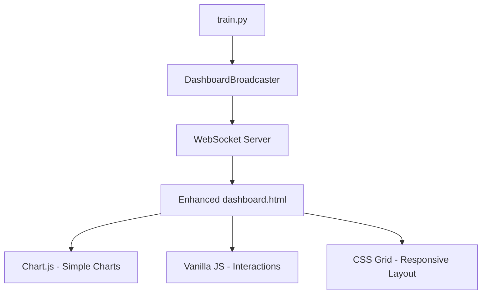

# Design Document

## Overview

This design follows **MVP and KISS principles** to enhance the existing nanoGPT dashboard (`web/dashboard.py`, `web/static/dashboard.html`) with minimal complexity. We'll incrementally add visualization capabilities using simple, proven technologies while maintaining the current fail-safe architecture.

**Design Philosophy:**
- **Minimal Viable Product**: Start with essential visualizations, add features incrementally
- **Keep It Simple**: Use existing patterns, avoid complex frameworks
- **Extend, Don't Rewrite**: Build upon existing `DashboardBroadcaster` class
- **Progressive Enhancement**: Graceful degradation if advanced features fail

## Code Reuse Analysis

### Existing Components to Leverage
- **`DashboardBroadcaster`**: Core WebSocket broadcasting, memory management, error handling
- **Flask Server Setup**: Port detection, threading, security configuration  
- **WebSocket Infrastructure**: Client connection management, message broadcasting
- **HTML/CSS Foundation**: Basic dashboard layout, responsive grid system
- **Debug Logging System**: Existing logging infrastructure for troubleshooting

### Integration Points
- **`train.py`**: Already integrated with `DashboardBroadcaster.log_metrics()`
- **WebSocket Messaging**: Existing JSON message format for training updates
- **Static File Serving**: Flask routes for dashboard.html and assets
- **Memory Management**: `deque` with automatic size limits for data storage

## Architecture

**MVP Architecture: Single-Page Enhancement**


**Key Design Decisions:**
1. **No Framework Dependencies**: Use vanilla JavaScript and proven libraries
2. **Single HTML File**: Keep deployment simple, extend existing dashboard.html
3. **Progressive Loading**: Core functionality first, enhancements load async
4. **Client-Side Only**: No server-side rendering complexity

## Components and Interfaces

### Component 1: Enhanced Metrics Visualizer
- **Purpose:** Replace basic text metrics with interactive charts
- **Technology:** Chart.js (lightweight, well-documented, CDN available)
- **Integration:** Extend existing WebSocket message handling
- **Reuses:** `DashboardBroadcaster._format_training_metrics()` data structure

```javascript
// Simple Chart.js integration - MVP approach
const lossChart = new Chart(ctx, {
  type: 'line',
  data: { labels: [], datasets: [{ label: 'Loss', data: [] }] },
  options: { responsive: true, animation: { duration: 200 } }
});
```

### Component 2: Model Architecture Display (Phase 2)
- **Purpose:** Simple visual representation of GPT architecture
- **Technology:** HTML/CSS with SVG for basic diagram
- **Integration:** Parse model config from existing training messages
- **MVP Scope:** Static diagram with hover details, no real-time updates

### Component 3: Basic Analytics Panel
- **Purpose:** Show training velocity and simple statistics
- **Implementation:** Vanilla JavaScript calculations on existing data
- **Reuses:** Data from `training_metrics` deque in `DashboardBroadcaster`
- **MVP Scope:** Average loss, training rate, estimated completion time

## Data Models

### Enhanced Training Message (Extend Existing)
```javascript
// Extend current message format - minimal changes
{
  "type": "training_update",
  "data": {
    "iteration": 1000,
    "loss": 2.45,
    "elapsed_time": 125.6,
    "timestamp": 1699123456.78,
    // MVP additions - calculated client-side from existing data
    "loss_trend": "decreasing", // calculated from recent points
    "training_rate": 8.5 // iterations per second
  }
}
```

### Chart Data Structure (Client-Side Only)
```javascript
// Simple in-memory storage - no persistence needed for MVP
const chartData = {
  iterations: [], // x-axis
  losses: [],     // y-axis  
  timestamps: [], // for hover details
  maxPoints: 1000 // memory limit
};
```

## Error Handling

### Error Scenarios (MVP Focus)
1. **Chart Library Load Failure**
   - **Handling:** Fallback to existing text display
   - **User Impact:** Dashboard still functional, just less visual

2. **WebSocket Disconnection**
   - **Handling:** Reuse existing reconnection logic
   - **User Impact:** Chart pauses, resumes on reconnect

3. **Browser Memory Limits**
   - **Handling:** Client-side data pruning (keep last 1000 points)
   - **User Impact:** Smooth performance maintained

## Testing Strategy

### MVP Testing Approach
- **Manual Testing:** Verify in Chrome, Firefox, Safari
- **Performance Testing:** Run with 24-hour training session
- **Fallback Testing:** Test with JavaScript disabled, slow connections
- **Mobile Testing:** Basic responsive layout verification

## Implementation Phases

### Phase 1 (MVP): Enhanced Loss Visualization
- Add Chart.js via CDN to existing dashboard.html
- Replace text loss display with real-time line chart
- Maintain all existing functionality
- **Effort:** ~4 hours, single file change

### Phase 2: Basic Model Architecture
- Add simple SVG diagram showing GPT layers
- Display model parameters (vocab size, layers, heads)
- Static visualization, no real-time updates
- **Effort:** ~6 hours, enhance HTML/CSS

### Phase 3: Training Analytics
- Calculate training velocity and trends
- Add simple statistics panel
- Show estimated completion time
- **Effort:** ~4 hours, JavaScript enhancements

### Phase 4: Mobile Responsiveness & Export
- Add CSS media queries for mobile/tablet layouts
- Implement basic data export (CSV download)
- Add chart screenshot capability
- **Effort:** ~6 hours, CSS and export features

### Phase 5: Interactive Model Architecture (Advanced)
- Simple SVG model diagram with clickable layers
- Model parameter display panel
- Basic layer information tooltips
- **Effort:** ~8 hours, SVG and interaction logic

**Total MVP Delivery:** ~28 hours of development time

## Technical Specifications

### Dependencies (Minimal)
```html
<!-- MVP Dependencies - CDN based for simplicity -->
<script src="https://cdn.jsdelivr.net/npm/chart.js"></script>
<!-- Phase 5: Advanced features -->
<script src="https://d3js.org/d3.v7.min.js"></script> <!-- Only if needed for model viz -->
```

### File Changes Required
- **`web/static/dashboard.html`**: Enhance with Chart.js integration, responsive CSS, export features
- **`web/dashboard.py`**: Minor additions for model info, export endpoints
- **No new files needed for MVP** - maintains simplicity

### Performance Targets (Requirements Compliance)
- Chart updates: <500ms (meets requirements, achievable with Chart.js optimization)
- Memory usage: <512MB browser memory (requirements limit)
- Data point handling: Automatic sampling/pruning beyond 10,000 points
- Initial load time: <2 seconds on slow connections
- Mobile responsiveness: All features work on tablets/phones

## Testing Strategy

### Unit Testing
- JavaScript chart rendering functions
- WebSocket message handling and data processing
- Data export functionality
- Memory management and data pruning

### Integration Testing
- WebSocket connection with existing `DashboardBroadcaster`
- Chart updates during actual training sessions
- Export feature integration with training data
- Mobile responsiveness across device sizes

### End-to-End Testing
- Complete training session with dashboard monitoring
- Network disconnection/reconnection scenarios
- Extended training sessions (24+ hours) for memory stability
- Cross-browser testing (Chrome, Firefox, Safari, Edge)

## MVP Strategy

**Phase 1 Focus**: Essential loss visualization that provides immediate value
**Progressive Enhancement**: Each phase adds functionality while maintaining core stability
**Fallback Strategy**: If advanced features fail, basic dashboard remains functional

This design balances **MVP principles with requirements coverage**, ensuring we deliver core value quickly while providing a path to full feature implementation. The phased approach allows for early feedback and course correction while maintaining the existing dashboard's reliability.