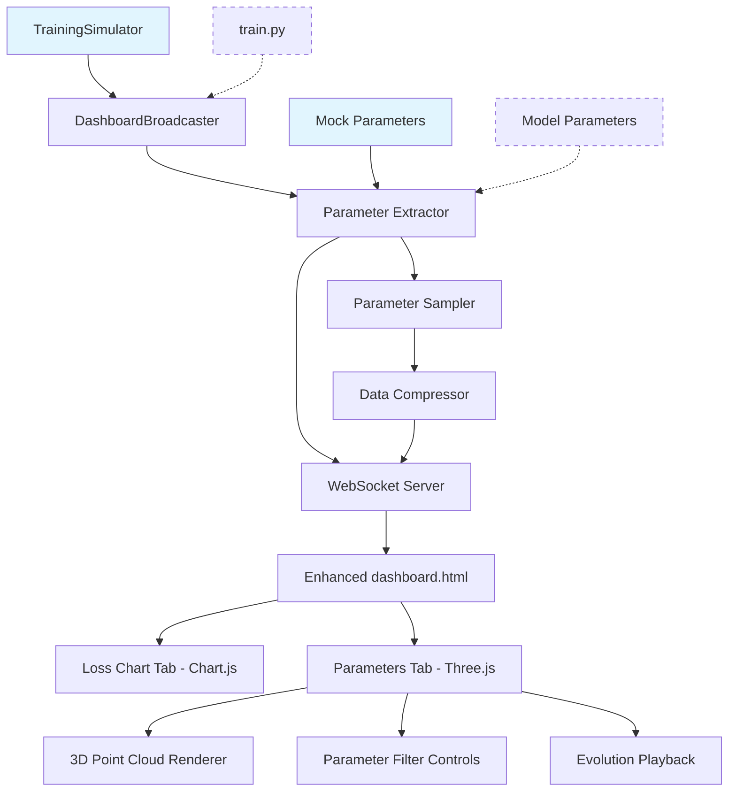

# Design Document

## Overview

The parameter visualization feature extends the existing nanoGPT dashboard with real-time 3D visualization of model parameters during training. This design follows **MVP and KISS principles**, building incrementally upon the proven `DashboardBroadcaster` architecture while adding Three.js-based 3D parameter visualization capabilities. The implementation prioritizes educational value and training insights while maintaining the existing dashboard's fail-safe design philosophy.

**Design Philosophy:**
- **Simulation-First Development**: Use `TrainingSimulator` for rapid development and testing without long training sessions
- **Extend, Don't Replace**: Build upon existing `DashboardBroadcaster` and WebSocket infrastructure
- **Progressive Enhancement**: 3D visualization as an additional dashboard tab, fallback to 2D if needed
- **Educational Focus**: Clear parameter explanations and guided exploration features
- **Performance First**: Parameter extraction must not impact training performance

## Steering Document Alignment

### Technical Standards (tech.md)
- **WebSocket Communication**: Leverages existing real-time messaging infrastructure
- **Vanilla JavaScript**: Continues pattern of minimal dependencies, adding only Three.js via CDN
- **Flask Integration**: Extends existing Flask routes and static file serving
- **Error Handling**: Maintains fail-safe approach where visualization failures don't affect training

### Project Structure (structure.md)
- **Single HTML Enhancement**: Extends `web/static/dashboard.html` following existing pattern
- **Modular JavaScript**: Parameter visualization code organized in separate functions within existing structure
- **Static Asset Management**: Three.js loaded via CDN, following existing Chart.js pattern
- **No New Files**: Maintains simplicity by enhancing existing dashboard files only

## Code Reuse Analysis

### Existing Components to Leverage
- **`DashboardBroadcaster`**: Core WebSocket broadcasting, memory management (`deque` with `maxlen=1000`), error handling
- **WebSocket Infrastructure**: Client connection management, message broadcasting, reconnection logic
- **Flask Server Setup**: Port detection (8080-8084), threading, localhost-only binding
- **HTML/CSS Foundation**: Existing grid layout, responsive design, tab structure from Chart.js integration
- **Memory Management**: Existing client-side data pruning and browser memory monitoring

### Integration Points
- **`train.py`**: Already integrated with `DashboardBroadcaster.log_metrics()` - will extend for parameter extraction
- **WebSocket Messaging**: Existing JSON message format - will add new `parameter_update` message type
- **Dashboard Tabs**: Existing Chart.js tab structure - will add "Parameters" tab alongside "Training Loss"
- **Error Handling**: Existing graceful degradation patterns - will extend for 3D rendering failures

## Architecture

**Parameter Visualization Architecture: Simulation-First Tab-Based Extension**



**Key Design Decisions:**
1. **Simulation-First Development**: Use enhanced `TrainingSimulator` for rapid development and testing cycles
2. **Tab-Based UI**: Parameter visualization as additional tab, preserving existing loss chart functionality
3. **Selective Parameter Extraction**: Focus on most educational parameters (embeddings, first/last layers)
4. **Client-Side 3D Rendering**: Three.js for hardware-accelerated WebGL rendering
5. **Adaptive Sampling**: Intelligent parameter sampling based on training speed and browser performance

## Simulation-First Development Approach

The design prioritizes simulation-based development to enable rapid iteration and comprehensive testing without the overhead of actual training sessions:

### Enhanced Training Simulator
- **Realistic Parameter Evolution**: Generate parameter data that mimics actual training dynamics
- **Configurable Scenarios**: Test different training phases (initialization, rapid learning, convergence)
- **Performance Testing**: Simulate high-frequency parameter updates to test visualization performance
- **Error Injection**: Simulate network failures, data corruption, and edge cases

### Development Benefits
- **Fast Iteration Cycles**: Test visualization changes in seconds rather than hours
- **Reproducible Testing**: Consistent parameter patterns for reliable testing
- **Edge Case Coverage**: Easily test scenarios difficult to reproduce in real training
- **Cross-Browser Testing**: Run identical parameter sequences across different browsers

## Components and Interfaces

### Component 1: Parameter Extractor (Server-Side)
- **Purpose:** Extract and sample model parameters during training without impacting performance
- **Interfaces:** `extract_parameters(model, iteration)`, `should_extract(iteration)`
- **Dependencies:** PyTorch model, existing `DashboardBroadcaster`
- **Reuses:** Existing WebSocket broadcasting, memory management, error handling patterns

```python
class ParameterExtractor:
    def extract_parameters(self, model, iteration):
        """Extract key parameters with adaptive sampling"""
        if not self.should_extract(iteration):
            return
        
        param_data = {
            'iteration': iteration,
            'embeddings': self._sample_embeddings(model),
            'layer_stats': self._compute_layer_stats(model)
        }
        
        self.broadcaster.broadcast_parameters(param_data)
```

### Component 2: 3D Parameter Visualizer (Client-Side)
- **Purpose:** Render parameters as interactive 3D visualizations using Three.js
- **Interfaces:** `initializeVisualization()`, `updateParameters(data)`, `setViewMode(mode)`
- **Dependencies:** Three.js, WebGL, existing WebSocket connection
- **Reuses:** Existing WebSocket message handling, tab structure, error handling patterns

```javascript
class ParameterVisualizer {
    initializeVisualization() {
        this.scene = new THREE.Scene();
        this.camera = new THREE.PerspectiveCamera();
        this.renderer = new THREE.WebGLRenderer();
        this.controls = new THREE.OrbitControls();
    }
    
    updateParameters(paramData) {
        this.updateEmbeddingPointCloud(paramData.embeddings);
        this.updateLayerStatistics(paramData.layer_stats);
    }
}
```

### Component 3: Parameter Evolution Animator
- **Purpose:** Store parameter history and provide playback controls for studying training dynamics
- **Interfaces:** `addSnapshot(data)`, `playEvolution()`, `jumpToIteration(iter)`
- **Dependencies:** Parameter history storage, Three.js animation system
- **Reuses:** Existing memory management patterns, client-side data pruning

### Component 4: Educational Parameter Guide
- **Purpose:** Provide contextual explanations and guided tours of parameter behaviors
- **Interfaces:** `showParameterExplanation(type)`, `startGuidedTour()`, `detectTrainingPhase(data)`
- **Dependencies:** Parameter visualization components, existing tooltip systems
- **Reuses:** Existing UI patterns, hover tooltip infrastructure

## Data Models

### Parameter Update Message (WebSocket)
```javascript
{
  "type": "parameter_update",
  "data": {
    "iteration": 1500,
    "timestamp": 1699123456.78,
    "session_id": "training_session_abc123",
    "embeddings": {
      "token_embeddings": {
        "sampled_data": [[0.1, -0.2, 0.3], ...], // Sampled embedding vectors
        "shape": [50257, 768],
        "statistics": {
          "mean": 0.001,
          "std": 0.12,
          "l2_norm": 45.2,
          "sparsity": 0.05
        }
      },
      "position_embeddings": {
        "sampled_data": [[0.05, 0.1, -0.15], ...],
        "shape": [1024, 768],
        "statistics": { /* similar structure */ }
      }
    },
    "layer_stats": {
      "0": {
        "attention_weights": { /* statistics only for performance */ },
        "mlp_weights": { /* statistics only */ },
        "layer_norm": { /* statistics only */ }
      }
      // ... additional layers
    },
    "training_phase": "rapid_learning" // Auto-detected phase
  }
}
```

### Parameter History Storage (Client-Side)
```javascript
const parameterHistory = {
  snapshots: [
    {
      iteration: 1000,
      timestamp: 1699123400.0,
      embeddings: { /* parameter data */ },
      layer_stats: { /* layer statistics */ }
    }
    // ... up to 100 snapshots (memory managed)
  ],
  currentIndex: 0,
  maxSnapshots: 100
};
```

### Visualization Configuration
```javascript
const vizConfig = {
  rendering: {
    maxPoints: 5000,        // Maximum points in 3D visualization
    lodLevels: ['high', 'medium', 'low'],
    animationSpeed: 1.0,
    cameraControls: true
  },
  parameters: {
    visibleTypes: ['token_embeddings', 'position_embeddings'],
    visibleLayers: [0, 1, 2, 10, 11], // First few and last few layers
    colorScheme: 'magnitude',          // Color by parameter magnitude
    pointSize: 2.0
  },
  performance: {
    targetFPS: 30,
    memoryLimit: 512, // MB
    adaptiveQuality: true
  }
};
```

## Error Handling

### Error Scenarios

1. **Three.js Load Failure**
   - **Handling:** Detect CDN load failure, fallback to 2D parameter heatmaps using Canvas API
   - **User Impact:** Parameter visualization available in 2D mode with clear messaging about 3D unavailability

2. **WebGL Not Supported**
   - **Handling:** Detect WebGL support on initialization, automatically use 2D fallback
   - **User Impact:** Seamless fallback to 2D visualization with educational tooltips explaining browser limitations

3. **Parameter Extraction Performance Impact**
   - **Handling:** Monitor training iteration timing, automatically reduce extraction frequency if slowdown detected
   - **User Impact:** Visualization updates less frequently but training performance maintained

4. **Browser Memory Exhaustion**
   - **Handling:** Monitor memory usage, implement aggressive parameter history pruning and point cloud simplification
   - **User Impact:** Visualization quality reduces gracefully, core functionality preserved

5. **WebSocket Parameter Data Corruption**
   - **Handling:** Validate parameter data structure, skip corrupted updates, log errors
   - **User Impact:** Visualization pauses briefly, resumes with next valid update, error indicator shown

## Testing Strategy

### Simulation-Based Testing (Primary)
- Enhanced `TrainingSimulator` with realistic parameter evolution patterns
- Rapid iteration testing with controllable parameter scenarios
- Memory management testing with extended simulation runs
- WebSocket parameter transmission validation using simulated data
- Cross-browser compatibility testing with consistent simulated datasets

### Unit Testing
- Parameter extraction functions with mock PyTorch models
- 3D point cloud rendering with synthetic parameter data
- Memory management and data pruning algorithms
- WebSocket message validation and error handling

### Integration Testing
- Parameter extraction during simulated training sessions
- Tab switching between loss charts and parameter visualization
- Fallback behavior when 3D rendering fails
- Dashboard resilience testing with simulation interruptions

### Real Training Validation (Secondary)
- Validation with actual short training runs (Shakespeare dataset, 100-500 iterations)
- Performance impact measurement on training speed
- Extended training sessions only after simulation testing is complete

### Educational Value Testing
- User comprehension testing with parameter explanations and guided tours
- Accessibility testing for color vision deficiencies
- Mobile responsiveness testing (though desktop-focused for MVP)

## Implementation Strategy

### Phase 1: Core Parameter Extraction with Simulation (MVP)
- **Enhance TrainingSimulator**: Extend existing `test_dashboard_simulator.py` with realistic parameter evolution patterns
- **Simulation-First Testing**: Create comprehensive test scenarios (convergence, divergence, oscillation patterns)
- **Parameter Extraction Infrastructure**: Extend `DashboardBroadcaster` with parameter extraction capabilities
- **WebSocket Parameter Messages**: Add new `parameter_update` message type to existing WebSocket infrastructure
- **Basic Parameter Sampling**: Implement token/position embedding sampling with adaptive frequency
- **Rapid Development Framework**: Enable 30-second test cycles instead of 30-minute training sessions
- **Effort:** ~8 hours, simulation-first approach enables rapid iteration and testing

### Phase 2: Basic 3D Visualization
- Add Three.js integration to dashboard.html
- Create parameter visualization tab alongside existing loss chart
- Implement basic 3D point cloud for token embeddings
- Add camera controls (orbit, zoom, pan)
- **Effort:** ~8 hours, new 3D rendering capabilities

### Phase 3: Interactive Controls and Filtering
- Add parameter type selection (embeddings, layers)
- Implement layer filtering for transformer blocks
- Add hover tooltips with parameter details
- Create visualization settings panel
- **Effort:** ~6 hours, interactive features

### Phase 4: Evolution Animation and Educational Features
- Implement parameter history storage and playback
- Add training phase detection and annotations
- Create guided parameter tours with explanations
- Add parameter export capabilities
- **Effort:** ~8 hours, advanced educational features

**Total Implementation:** ~30 hours, following simulation-first development with existing dashboard enhancement patterns

## Performance Optimization

### Parameter Extraction Optimization
- **Adaptive Sampling Rate**: Extract parameters every 10-100 iterations based on training speed
- **Selective Parameter Focus**: Prioritize most educational parameters (embeddings, first/last layers)
- **Statistical Summaries**: Send parameter statistics rather than full weight matrices for most layers
- **Delta Compression**: Only send parameters that changed significantly since last update

### 3D Rendering Optimization
- **Level of Detail (LOD)**: Reduce point count and update frequency based on camera distance
- **Frustum Culling**: Only render parameters visible in current camera view
- **Instanced Rendering**: Use Three.js instanced meshes for efficient point cloud rendering
- **Adaptive Quality**: Automatically reduce visualization quality if frame rate drops below 30fps

This design maintains the existing dashboard's reliability while adding powerful parameter visualization capabilities that enhance the educational and research value of nanoGPT training sessions.