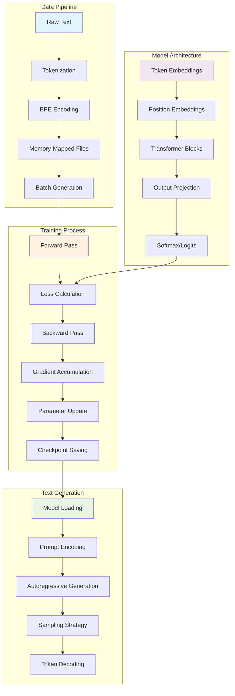
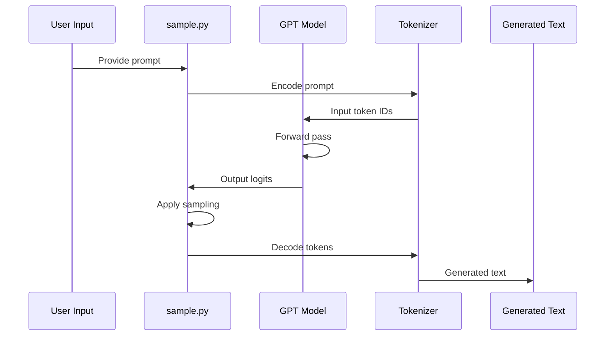
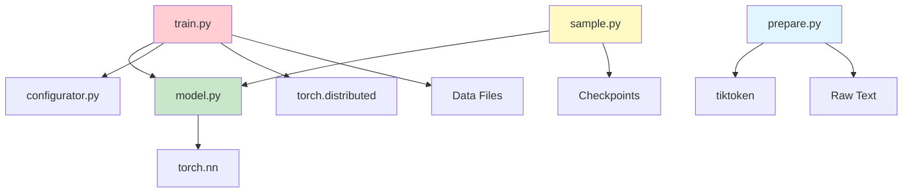
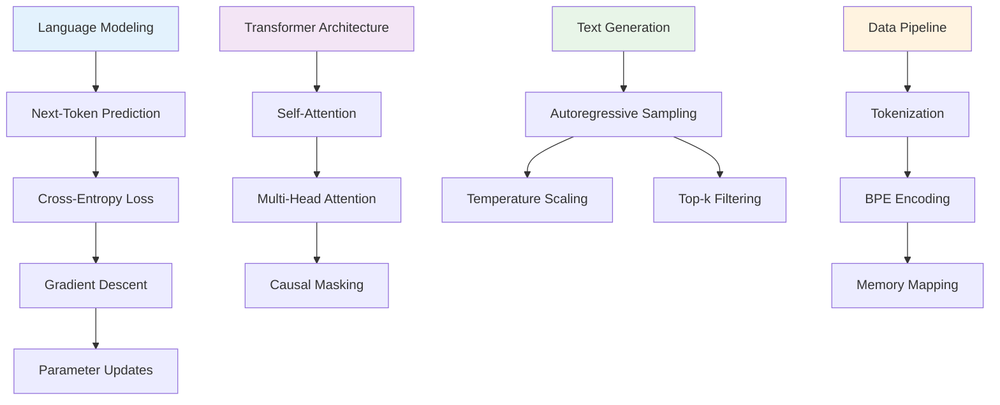

# nanoGPT Concept Map

This document provides visual and textual representations of how different concepts and components in nanoGPT relate to each other. Use this to understand the system architecture and data flow.

## System Architecture Overview



## Component Interaction Matrix

| Component | Interacts With | Relationship Type | Documentation |
|-----------|----------------|-------------------|---------------|
| **GPT Model** | Transformer Blocks | Contains | [model.py](code-analysis/model-py-analysis.md#gpt-model-class-structure) |
| **GPT Model** | Token Embeddings | Uses | [model.py](code-analysis/model-py-analysis.md#embedding-layers) |
| **GPT Model** | Training Loop | Used by | [train.py](code-analysis/train-py-analysis.md#model-initialization) |
| **Transformer Block** | Self-Attention | Contains | [model.py](code-analysis/model-py-analysis.md#transformer-block) |
| **Transformer Block** | MLP | Contains | [model.py](code-analysis/model-py-analysis.md#mlp-feed-forward-block) |
| **Self-Attention** | Causal Masking | Implements | [model.py](code-analysis/model-py-analysis.md#causal-masking-implementation) |
| **Training Loop** | Data Loader | Uses | [train.py](code-analysis/train-py-analysis.md#data-loading) |
| **Training Loop** | Optimizer | Uses | [train.py](code-analysis/train-py-analysis.md#optimizer-setup) |
| **Data Preparation** | Tokenizer | Uses | [prepare.py](code-analysis/prepare-py-analysis.md#tokenization-pipeline) |
| **Text Generation** | Sampling Strategy | Implements | [sample.py](code-analysis/sample-py-analysis.md#sampling-strategies) |

## Data Flow Diagrams

### Training Data Flow

```mermaid
sequenceDiagram
    participant Raw as Raw Text Files
    participant Prep as prepare.py
    participant Mem as Memory-Mapped Files
    participant Train as train.py
    participant Model as GPT Model
    participant Opt as Optimizer
    
    Raw->>Prep: Load text data
    Prep->>Prep: Tokenize with BPE
    Prep->>Mem: Create binary files
    Train->>Mem: Load batches
    Train->>Model: Forward pass
    Model->>Train: Loss & logits
    Train->>Opt: Compute gradients
    Opt->>Model: Update parameters
    Train->>Train: Save checkpoint
```

### Inference Data Flow



## Conceptual Hierarchies

### Architecture Hierarchy

```
GPT Model
├── Token Embeddings
├── Position Embeddings
├── Transformer Blocks (×N)
│   ├── Layer Normalization
│   ├── Multi-Head Self-Attention
│   │   ├── Query Projection
│   │   ├── Key Projection
│   │   ├── Value Projection
│   │   ├── Attention Computation
│   │   ├── Causal Masking
│   │   └── Output Projection
│   ├── Residual Connection
│   ├── Layer Normalization
│   ├── MLP Block
│   │   ├── Linear Layer 1
│   │   ├── GELU Activation
│   │   ├── Linear Layer 2
│   │   └── Dropout
│   └── Residual Connection
├── Final Layer Normalization
└── Output Projection (to vocabulary)
```

**Documentation Links:**
- [GPT Model Structure](code-analysis/model-py-analysis.md#gpt-model-class-structure)
- [Transformer Block Details](code-analysis/model-py-analysis.md#transformer-block)
- [Attention Implementation](code-analysis/model-py-analysis.md#causalselfattention-implementation)

### Training Process Hierarchy

```
Training Pipeline
├── Configuration Loading
│   ├── Default Parameters
│   ├── Config File Override
│   └── Command Line Override
├── Distributed Setup (Optional)
│   ├── Process Group Initialization
│   ├── Device Assignment
│   └── DDP Model Wrapping
├── Model Initialization
│   ├── Architecture Configuration
│   ├── Parameter Initialization
│   └── Optimizer Setup
├── Data Loading
│   ├── Memory-Mapped File Access
│   ├── Batch Generation
│   └── Device Transfer
├── Training Loop
│   ├── Forward Pass
│   ├── Loss Calculation
│   ├── Backward Pass
│   ├── Gradient Accumulation
│   ├── Parameter Update
│   └── Learning Rate Scheduling
└── Checkpointing
    ├── Model State Saving
    ├── Optimizer State Saving
    └── Training Metadata
```

**Documentation Links:**
- [Training Pipeline](code-analysis/train-py-analysis.md#training-loop-implementation)
- [Configuration System](code-analysis/configurator-py-analysis.md)
- [Distributed Training](code-analysis/train-py-analysis.md#distributed-training-setup)

## Dependency Relationships

### File Dependencies



### Concept Dependencies



## Integration Points

### Model ↔ Training Integration

| Integration Point | Description | Implementation |
|-------------------|-------------|----------------|
| **Model Creation** | Training script instantiates GPT model | [train.py:model_init](code-analysis/train-py-analysis.md#model-initialization) |
| **Forward Pass** | Training calls model forward method | [train.py:forward](code-analysis/train-py-analysis.md#forward-pass) |
| **Loss Calculation** | Model outputs used for loss computation | [train.py:loss](code-analysis/train-py-analysis.md#loss-calculation) |
| **Parameter Access** | Training accesses model parameters for optimization | [train.py:optimizer](code-analysis/train-py-analysis.md#optimizer-setup) |
| **Checkpoint Saving** | Training saves model state | [train.py:checkpoint](code-analysis/train-py-analysis.md#checkpoint-management) |

### Model ↔ Inference Integration

| Integration Point | Description | Implementation |
|-------------------|-------------|----------------|
| **Model Loading** | Inference loads trained model weights | [sample.py:loading](code-analysis/sample-py-analysis.md#model-loading) |
| **Generation** | Inference calls model generate method | [sample.py:generation](code-analysis/sample-py-analysis.md#text-generation-pipeline) |
| **Sampling** | Model outputs processed by sampling strategies | [sample.py:sampling](code-analysis/sample-py-analysis.md#sampling-strategies) |

### Data ↔ Training Integration

| Integration Point | Description | Implementation |
|-------------------|-------------|----------------|
| **Data Loading** | Training loads preprocessed data | [train.py:data_loading](code-analysis/train-py-analysis.md#data-loading) |
| **Batch Generation** | Training creates batches from data files | [train.py:get_batch](code-analysis/train-py-analysis.md#batch-processing) |
| **Tokenization** | Data preparation creates token mappings | [prepare.py:tokenization](code-analysis/prepare-py-analysis.md#tokenization-pipeline) |

## Performance Optimization Relationships

### Memory Optimization Chain

```
Raw Text → Tokenization → Binary Files → Memory Mapping → Efficient Loading
    ↓           ↓            ↓              ↓               ↓
[prepare.py] [tiktoken] [numpy arrays] [mmap files] [train.py batching]
```

### Compute Optimization Chain

```
Model Definition → Compilation → Mixed Precision → Distributed Training
       ↓              ↓             ↓                    ↓
   [model.py]   [torch.compile]  [autocast]      [DDP wrapping]
```

### Generation Optimization Chain

```
Model Loading → Compilation → Efficient Sampling → Fast Decoding
      ↓             ↓              ↓                   ↓
  [checkpoint]  [torch.compile] [top-k/temp]      [tiktoken]
```

## Learning Pathways

### Beginner Path
1. **Start**: [GPT Architecture Concepts](concepts/gpt-architecture.md)
2. **Then**: [Model Implementation](code-analysis/model-py-analysis.md)
3. **Next**: [Training Concepts](concepts/training-process.md)
4. **Finally**: [Text Generation](concepts/text-generation-algorithms.md)

### Intermediate Path
1. **Start**: [Training Implementation](code-analysis/train-py-analysis.md)
2. **Then**: [Data Pipeline](concepts/data-pipeline.md)
3. **Next**: [Configuration System](code-analysis/configurator-py-analysis.md)
4. **Finally**: [Inference Pipeline](code-analysis/sample-py-analysis.md)

### Advanced Path
1. **Start**: [Distributed Training](code-analysis/train-py-analysis.md#distributed-training-setup)
2. **Then**: [Performance Optimization](code-analysis/train-py-analysis.md#performance-optimization)
3. **Next**: [Memory Management](code-analysis/prepare-py-analysis.md#memory-optimization)
4. **Finally**: [Custom Extensions](concepts/gpt-architecture.md#extensibility)

---

## Quick Navigation

- **[Glossary](glossary.md)**: Definitions of all technical terms
- **[Concept Index](concept-index.md)**: Quick reference for finding concepts
- **[Documentation Home](README.md)**: Main documentation overview

## Search Tags

### Architecture Tags
`transformer` `attention` `gpt` `decoder` `embedding` `mlp` `layernorm` `residual` `causal` `multihead`

### Training Tags  
`optimization` `gradient` `backprop` `loss` `crossentropy` `adamw` `learning-rate` `batch` `distributed` `ddp`

### Data Tags
`tokenization` `bpe` `encoding` `preprocessing` `memmap` `batch-generation` `vocabulary` `dataset`

### Generation Tags
`inference` `sampling` `temperature` `topk` `autoregressive` `decoding` `generation` `prompt`

### Implementation Tags
`pytorch` `model.py` `train.py` `sample.py` `prepare.py` `configurator.py` `checkpoint` `compilation`

---

*This concept map is designed to help you understand the relationships between different parts of the nanoGPT system. Use it alongside the detailed documentation to build a complete mental model of how everything fits together.*