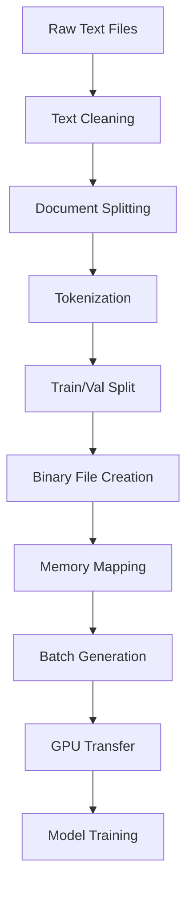

# Data Pipeline Concepts

## Introduction

This document explains the fundamental concepts behind data processing for GPT training, covering tokenization, dataset preparation, batching strategies, and memory optimization. Understanding these concepts is crucial for efficiently preparing and serving data to language models during training.

## Tokenization Concepts

### From Text to Tokens

Tokenization converts raw text into discrete units (tokens) that neural networks can process. This transformation is fundamental to all NLP tasks.

#### Why Tokenization is Necessary

**Neural networks require fixed vocabularies:**
- Cannot handle infinite possible character combinations
- Need consistent input/output dimensions
- Require efficient lookup mechanisms

**Text is inherently variable:**
- Unlimited vocabulary in natural language
- Different languages and writing systems
- Spelling variations and new words

### Tokenization Strategies

#### Character-Level Tokenization

**Approach**: Each character is a separate token
```
"Hello" → ['H', 'e', l', 'l', 'o']
```

**Advantages:**
- Small vocabulary size
- Handles any text input
- No out-of-vocabulary issues

**Disadvantages:**
- Long sequences for meaningful text
- Loses word-level semantic information
- Computationally expensive for long texts

#### Word-Level Tokenization

**Approach**: Each word is a separate token
```
"Hello world" → ['Hello', 'world']
```

**Advantages:**
- Preserves semantic units
- Shorter sequences
- Intuitive for humans

**Disadvantages:**
- Large vocabulary requirements
- Out-of-vocabulary word problems
- Language-specific challenges

#### Subword Tokenization

**Approach**: Balance between characters and words
```
"unhappiness" → ['un', 'happy', 'ness']
```

**Advantages:**
- Manageable vocabulary size
- Handles rare/new words
- Captures morphological patterns
- Language-agnostic approach

## Byte Pair Encoding (BPE)

### Algorithm Overview

BPE is a data compression technique adapted for tokenization that iteratively merges the most frequent character pairs.

#### Training Process

1. **Initialize**: Start with character-level vocabulary
2. **Count Pairs**: Find most frequent adjacent character pairs
3. **Merge**: Replace most frequent pair with new token
4. **Repeat**: Continue until desired vocabulary size reached

#### Example BPE Training

**Initial text**: "low lower newest widest"

**Step 1**: Character vocabulary
```
Vocabulary: ['l', 'o', 'w', 'e', 'r', 'n', 's', 't', 'i', 'd']
Text: ['l', 'o', 'w'] ['l', 'o', 'w', 'e', 'r'] ['n', 'e', 'w', 'e', 's', 't'] ['w', 'i', 'd', 'e', 's', 't']
```

**Step 2**: Most frequent pair is ('e', 's')
```
Vocabulary: ['l', 'o', 'w', 'e', 'r', 'n', 's', 't', 'i', 'd', 'es']
Text: ['l', 'o', 'w'] ['l', 'o', 'w', 'e', 'r'] ['n', 'e', 'w', 'es', 't'] ['w', 'i', 'd', 'es', 't']
```

**Step 3**: Most frequent pair is ('es', 't')
```
Vocabulary: ['l', 'o', 'w', 'e', 'r', 'n', 's', 't', 'i', 'd', 'es', 'est']
Text: ['l', 'o', 'w'] ['l', 'o', 'w', 'e', 'r'] ['n', 'e', 'w', 'est'] ['w', 'i', 'd', 'est']
```

### BPE Advantages

#### Vocabulary Efficiency

- **Fixed Size**: Predetermined vocabulary size (typically 50K tokens)
- **Frequency-Based**: Common subwords get dedicated tokens
- **Compositional**: Rare words decomposed into known parts

#### Handling Unknown Words

```
# Known word
"running" → ['running']

# Unknown word  
"unrunnable" → ['un', 'run', 'nable']
```

#### Cross-Lingual Benefits

- Shared subwords across languages
- Efficient multilingual models
- Reduced vocabulary explosion

### GPT-2 Tokenizer Specifics

#### Byte-Level BPE

GPT-2 uses a variant that operates on bytes rather than Unicode characters:

**Benefits:**
- Handles any Unicode text
- No preprocessing required
- Consistent across languages and scripts

**Process:**
1. Convert text to UTF-8 bytes
2. Apply BPE on byte sequences
3. Map bytes back to Unicode for display

#### Special Tokens

```python
# GPT-2 tokenizer special tokens
{
    '<|endoftext|>': 50256,  # End of document marker
    # No padding, start, or unknown tokens
}
```

## Dataset Preparation Pipeline

### Raw Text Processing

#### Text Cleaning

**Common preprocessing steps:**
- Remove or normalize special characters
- Handle encoding issues (UTF-8 normalization)
- Filter out low-quality text
- Deduplicate content

**Quality Filtering:**
```python
def filter_text(text):
    # Remove very short documents
    if len(text) < 100:
        return False
    
    # Remove documents with too many special characters
    special_char_ratio = sum(not c.isalnum() and not c.isspace() 
                           for c in text) / len(text)
    if special_char_ratio > 0.3:
        return False
    
    # Remove documents with unusual language patterns
    if detect_language(text) not in ALLOWED_LANGUAGES:
        return False
    
    return True
```

#### Document Boundaries

**Handling multiple documents:**
- Insert special tokens between documents
- Maintain document structure information
- Enable document-aware sampling

### Tokenization Pipeline

#### Batch Processing

```python
def tokenize_dataset(texts, tokenizer, batch_size=1000):
    all_tokens = []
    
    for i in range(0, len(texts), batch_size):
        batch = texts[i:i + batch_size]
        
        # Tokenize batch
        batch_tokens = tokenizer(batch)['input_ids']
        
        # Add end-of-text tokens between documents
        for tokens in batch_tokens:
            all_tokens.extend(tokens)
            all_tokens.append(tokenizer.eos_token_id)
    
    return all_tokens
```

#### Memory Management

**Streaming Processing:**
- Process data in chunks to avoid memory overflow
- Use generators for large datasets
- Implement checkpointing for resumable processing

### Train/Validation Split

#### Splitting Strategies

**Random Split:**
```python
# Simple random split
train_size = int(0.9 * len(tokens))
train_tokens = tokens[:train_size]
val_tokens = tokens[train_size:]
```

**Document-Aware Split:**
```python
# Ensure documents aren't split across train/val
def document_aware_split(documents, split_ratio=0.9):
    random.shuffle(documents)
    split_idx = int(len(documents) * split_ratio)
    
    train_docs = documents[:split_idx]
    val_docs = documents[split_idx:]
    
    return train_docs, val_docs
```

#### Validation Set Considerations

**Size Guidelines:**
- Typically 5-10% of total data
- Minimum 10M tokens for reliable evaluation
- Balance between evaluation quality and training data

**Representativeness:**
- Should reflect training data distribution
- Include diverse content types
- Maintain temporal consistency if relevant

## Binary File Generation

### Memory-Mapped Files

#### Why Memory Mapping?

**Traditional File I/O Problems:**
- Entire file loaded into RAM
- Slow random access
- Memory limitations for large datasets

**Memory Mapping Benefits:**
- OS handles memory management
- Fast random access to any position
- Efficient for large files
- Shared memory across processes

#### Implementation

```python
import numpy as np

# Create memory-mapped array
def create_memmap(tokens, filename):
    # Convert to numpy array
    arr = np.array(tokens, dtype=np.uint16)
    
    # Save as memory-mapped file
    memmap = np.memmap(filename, dtype=np.uint16, mode='w+', shape=arr.shape)
    memmap[:] = arr[:]
    memmap.flush()
    
    return memmap

# Load memory-mapped array
def load_memmap(filename):
    return np.memmap(filename, dtype=np.uint16, mode='r')
```

### File Format Specification

#### Binary Layout

```
File Structure:
[Header: 8 bytes]
[Token Data: N * 2 bytes]

Header Format:
- Magic Number: 4 bytes (0x474E4E47 = "GNNG")
- Version: 2 bytes
- Token Count: 8 bytes (uint64)

Token Data:
- Each token: 2 bytes (uint16)
- Sequential storage
- Little-endian byte order
```

#### Advantages of Binary Format

**Performance:**
- No parsing overhead
- Direct memory mapping
- Efficient random access

**Storage:**
- Compact representation
- No text encoding overhead
- Predictable file sizes

**Compatibility:**
- Language-agnostic format
- Cross-platform compatibility
- Version control friendly

## Batching and Data Loading

### Batch Generation Strategy

#### Random Sampling

```python
def get_batch(data, batch_size, block_size):
    # Generate random starting positions
    ix = torch.randint(len(data) - block_size, (batch_size,))
    
    # Extract sequences
    x = torch.stack([data[i:i+block_size] for i in ix])
    y = torch.stack([data[i+1:i+block_size+1] for i in ix])
    
    return x, y
```

**Benefits:**
- Uniform sampling across dataset
- Prevents overfitting to sequence order
- Enables parallel batch generation

#### Sequential Sampling

```python
def get_sequential_batch(data, batch_size, block_size, start_pos):
    sequences = []
    targets = []
    
    for i in range(batch_size):
        pos = start_pos + i * block_size
        if pos + block_size + 1 <= len(data):
            sequences.append(data[pos:pos+block_size])
            targets.append(data[pos+1:pos+block_size+1])
    
    return torch.stack(sequences), torch.stack(targets)
```

**Use Cases:**
- Evaluation (deterministic)
- Debugging and analysis
- Curriculum learning

### Memory Optimization Strategies

#### Pinned Memory

```python
# Allocate pinned memory for faster GPU transfer
x = torch.empty(batch_size, block_size, dtype=torch.long, pin_memory=True)
y = torch.empty(batch_size, block_size, dtype=torch.long, pin_memory=True)

# Asynchronous GPU transfer
x_gpu = x.to(device, non_blocking=True)
y_gpu = y.to(device, non_blocking=True)
```

**Benefits:**
- Faster CPU-GPU transfers
- Overlapped computation and data movement
- Reduced transfer latency

#### Data Prefetching

```python
class DataPrefetcher:
    def __init__(self, loader, device):
        self.loader = iter(loader)
        self.device = device
        self.stream = torch.cuda.Stream()
        self.preload()
    
    def preload(self):
        try:
            self.next_input, self.next_target = next(self.loader)
            with torch.cuda.stream(self.stream):
                self.next_input = self.next_input.to(self.device, non_blocking=True)
                self.next_target = self.next_target.to(self.device, non_blocking=True)
        except StopIteration:
            self.next_input = None
            self.next_target = None
    
    def next(self):
        torch.cuda.current_stream().wait_stream(self.stream)
        input_data = self.next_input
        target_data = self.next_target
        self.preload()
        return input_data, target_data
```

### Sequence Length Considerations

#### Fixed vs. Variable Length

**Fixed Length (GPT approach):**
- All sequences padded/truncated to same length
- Efficient batching and computation
- Simpler implementation

**Variable Length:**
- Preserves natural document boundaries
- More complex batching logic
- Requires padding and masking

#### Block Size Selection

**Factors to consider:**
- Model's maximum context length
- Available GPU memory
- Training efficiency vs. context utilization

**Common strategies:**
```python
# Progressive block size increase
def get_block_size(training_step, max_block_size):
    if training_step < 1000:
        return 128
    elif training_step < 5000:
        return 256
    elif training_step < 10000:
        return 512
    else:
        return max_block_size
```

## Data Format Conversion

### From Raw Text to Model Input

#### Complete Pipeline



#### Data Types and Precision

**Token IDs:**
- uint16 for vocabularies < 65536
- uint32 for larger vocabularies
- Memory vs. range tradeoff

**Attention Masks:**
- bool for memory efficiency
- uint8 for compatibility
- float32 for custom attention patterns

### Efficient Data Structures

#### Numpy Arrays

```python
# Efficient token storage
tokens = np.array(token_list, dtype=np.uint16)

# Memory usage calculation
memory_gb = tokens.nbytes / (1024**3)
print(f"Dataset size: {memory_gb:.2f} GB")
```

#### PyTorch Tensors

```python
# Convert numpy to PyTorch
tensor = torch.from_numpy(tokens)

# Ensure correct device and dtype
tensor = tensor.to(device=device, dtype=torch.long)
```

## Performance Optimization

### I/O Optimization

#### Parallel Data Loading

```python
from torch.utils.data import DataLoader
from multiprocessing import cpu_count

# Multi-process data loading
dataloader = DataLoader(
    dataset,
    batch_size=batch_size,
    num_workers=min(cpu_count(), 8),
    pin_memory=True,
    persistent_workers=True
)
```

#### Disk I/O Patterns

**Sequential Access:**
- Faster for HDDs
- Better for initial data processing
- Predictable performance

**Random Access:**
- Required for random sampling
- Better with SSDs
- Memory mapping helps

### Memory Usage Optimization

#### Vocabulary Size Impact

```python
# Memory usage by vocabulary size
vocab_sizes = [32000, 50000, 100000]
for vocab_size in vocab_sizes:
    embedding_memory = vocab_size * hidden_size * 4  # float32
    print(f"Vocab {vocab_size}: {embedding_memory / 1e9:.2f} GB")
```

#### Gradient Checkpointing

Trade computation for memory:
```python
# Enable gradient checkpointing
model.gradient_checkpointing_enable()

# Reduces activation memory by ~50%
# Increases training time by ~20%
```

## Quality Assurance

### Data Validation

#### Token Distribution Analysis

```python
def analyze_token_distribution(tokens):
    unique, counts = np.unique(tokens, return_counts=True)
    
    # Check for vocabulary coverage
    vocab_coverage = len(unique) / vocab_size
    
    # Identify rare tokens
    rare_tokens = unique[counts < 10]
    
    # Check for token frequency distribution
    frequency_stats = {
        'mean': np.mean(counts),
        'std': np.std(counts),
        'min': np.min(counts),
        'max': np.max(counts)
    }
    
    return {
        'vocab_coverage': vocab_coverage,
        'rare_tokens': rare_tokens,
        'frequency_stats': frequency_stats
    }
```

#### Sequence Length Analysis

```python
def analyze_sequence_lengths(documents):
    lengths = [len(doc) for doc in documents]
    
    return {
        'mean_length': np.mean(lengths),
        'median_length': np.median(lengths),
        'percentiles': np.percentile(lengths, [25, 50, 75, 90, 95, 99]),
        'max_length': np.max(lengths)
    }
```

### Data Integrity Checks

#### Corruption Detection

```python
def validate_binary_file(filename, expected_tokens):
    try:
        data = np.memmap(filename, dtype=np.uint16, mode='r')
        
        # Check file size
        if len(data) != expected_tokens:
            return False, f"Size mismatch: {len(data)} vs {expected_tokens}"
        
        # Check for invalid token IDs
        max_valid_id = vocab_size - 1
        invalid_tokens = np.sum(data >= vocab_size)
        if invalid_tokens > 0:
            return False, f"Found {invalid_tokens} invalid token IDs"
        
        # Check for reasonable distribution
        unique_tokens = len(np.unique(data))
        if unique_tokens < vocab_size * 0.1:  # Less than 10% vocab used
            return False, f"Suspiciously low vocabulary usage: {unique_tokens}"
        
        return True, "File validation passed"
        
    except Exception as e:
        return False, f"Validation error: {str(e)}"
```

## Conclusion

The data pipeline is a critical component of GPT training that transforms raw text into efficiently accessible training data. Key principles include:

1. **Tokenization Strategy**: BPE provides optimal balance between vocabulary size and semantic preservation
2. **Efficient Storage**: Binary formats with memory mapping enable fast random access to large datasets
3. **Batching Optimization**: Random sampling with efficient GPU transfer maximizes training throughput
4. **Quality Assurance**: Validation and monitoring ensure data integrity throughout the pipeline

Understanding these concepts enables effective data preparation for large-scale language model training and helps optimize the entire training pipeline for maximum efficiency.