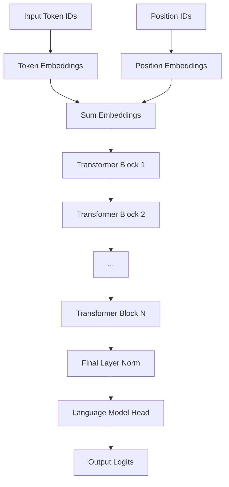
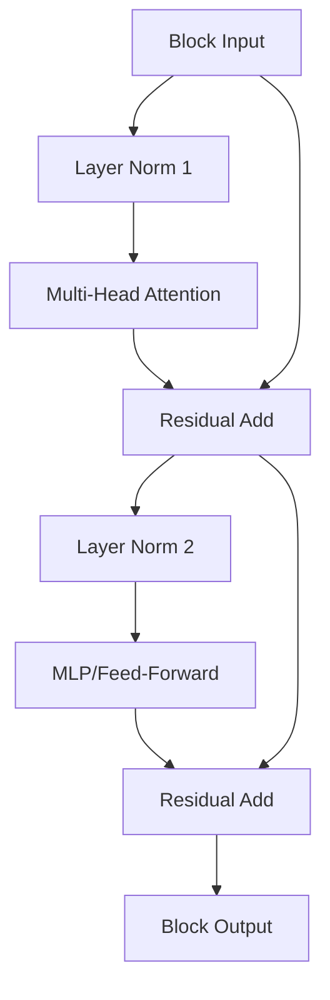
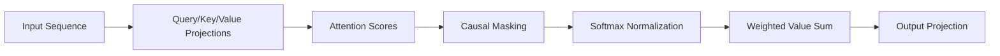

# GPT Architecture Concepts

> **Related Documentation**: [model.py Implementation](../code-analysis/model-py-analysis.md) | [Training Process](training-process.md) | [Text Generation](text-generation-algorithms.md) | [Concept Index](../concept-index.md#architecture-concepts)

## Introduction

The Generative Pre-trained Transformer (GPT) is a neural network architecture designed for autoregressive language modeling. This document explains the core concepts behind the transformer architecture and GPT-specific modifications that make it particularly effective for text generation tasks.

> **Implementation Note**: For the actual code implementation of these concepts, see the [model.py Analysis](../code-analysis/model-py-analysis.md)

## Transformer Architecture Foundation

### Core Principles

The transformer architecture, introduced in "Attention is All You Need" (Vaswani et al., 2017), revolutionized natural language processing by replacing recurrent and convolutional layers with self-attention mechanisms. Key innovations include:

1. **Parallelizable Computation**: Unlike RNNs, transformers can process all positions in a sequence simultaneously
2. **Long-Range Dependencies**: Self-attention allows direct connections between any two positions
3. **Scalability**: Architecture scales effectively with increased model size and data

### Architecture Components

The transformer consists of two main components:
- **Encoder**: Processes input sequences bidirectionally
- **Decoder**: Generates output sequences autoregressively

GPT uses only the decoder portion, making it a "decoder-only" transformer optimized for generation tasks.

## GPT-Specific Modifications

### Decoder-Only Architecture

GPT eliminates the encoder entirely and focuses on the decoder stack:

```
Input Tokens → Embeddings → Transformer Blocks → Output Logits
```

> **Implementation**: See [GPT Class Structure](../code-analysis/model-py-analysis.md#gpt-model-class-structure) for the actual decoder-only implementation

**Benefits of Decoder-Only Design:**
- Simplified architecture reduces complexity
- Autoregressive generation is natural fit for language modeling → *See [Training Process](training-process.md#next-token-prediction)*
- Unified training and inference procedures → *Compare [Training Loop](../code-analysis/train-py-analysis.md#training-loop-implementation) and [Inference Pipeline](../code-analysis/sample-py-analysis.md#text-generation-pipeline)*
- Better scaling properties for large models

### Causal Self-Attention

GPT modifies standard self-attention to be "causal" or "masked":

**Standard Attention**: Each position can attend to all other positions
**Causal Attention**: Each position can only attend to previous positions

This ensures the model cannot "cheat" by looking at future tokens during training, making it suitable for next-token prediction.

## Attention Mechanisms Deep Dive

### Multi-Head Self-Attention

The attention mechanism allows the model to focus on different parts of the input sequence when processing each token.

#### Mathematical Foundation

For a sequence of tokens, attention computes:

```
Attention(Q, K, V) = softmax(QK^T / √d_k)V
```

Where:
- **Q (Query)**: What information we're looking for
- **K (Key)**: What information is available at each position  
- **V (Value)**: The actual information content
- **d_k**: Dimension of key vectors (for scaling)

#### Multi-Head Mechanism

Instead of single attention, GPT uses multiple "heads" that learn different types of relationships:

```
MultiHead(Q, K, V) = Concat(head_1, ..., head_h)W^O
where head_i = Attention(QW_i^Q, KW_i^K, VW_i^V)
```

> **Implementation**: See [CausalSelfAttention Class](../code-analysis/model-py-analysis.md#causalselfattention-implementation) for the complete multi-head attention implementation

**Benefits of Multiple Heads:**
- Different heads can focus on different linguistic phenomena
- Some heads learn syntactic relationships, others semantic
- Increased model expressiveness and representational capacity

### Causal Masking Implementation

To enforce causality, GPT applies a triangular mask during attention computation:

```
Mask Matrix (4x4 example):
[1, 0, 0, 0]  # Token 1 can only see itself
[1, 1, 0, 0]  # Token 2 can see tokens 1-2
[1, 1, 1, 0]  # Token 3 can see tokens 1-3
[1, 1, 1, 1]  # Token 4 can see tokens 1-4
```

This mask is applied before the softmax operation, setting future positions to negative infinity.

## Positional Encoding

### The Position Problem

Transformers process all positions simultaneously, losing sequential order information. Positional encoding solves this by adding position-specific signals to token embeddings.

### Learned vs. Fixed Positional Embeddings

**GPT uses learned positional embeddings:**
- Each position (0 to max_sequence_length) has a learnable embedding vector
- These are added to token embeddings before processing
- Model learns optimal position representations during training

**Alternative approaches:**
- Sinusoidal encodings (original transformer)
- Relative positional encodings
- Rotary positional embeddings (RoPE)

### Position Embedding Integration

```
final_embedding = token_embedding + position_embedding
```

This simple addition allows the model to understand both "what" (token content) and "where" (position in sequence).

## Layer Architecture

### Transformer Block Structure

Each GPT transformer block follows this pattern:

```
Input
  ↓
Layer Norm
  ↓
Multi-Head Attention
  ↓
Residual Connection (+)
  ↓
Layer Norm  
  ↓
Feed-Forward Network (MLP)
  ↓
Residual Connection (+)
  ↓
Output
```

### Pre-Layer Normalization

GPT uses "pre-norm" architecture where layer normalization occurs before each sub-layer rather than after. This improves training stability and gradient flow.

### Feed-Forward Networks (MLP)

The MLP component provides non-linear transformations:

```
MLP(x) = GELU(xW₁ + b₁)W₂ + b₂
```

**Key characteristics:**
- Expands dimensionality (typically 4x hidden size)
- Uses GELU activation function
- Provides position-wise processing
- Adds non-linearity to the model

### Residual Connections

Residual connections enable deep networks by allowing gradients to flow directly through skip connections:

```
output = layer_function(input) + input
```

**Benefits:**
- Prevents vanishing gradients in deep networks
- Allows training of very deep models (100+ layers)
- Provides identity mapping when layer learns nothing

## Data Flow Through the Model

### Forward Pass Visualization



### Detailed Block Processing

Within each transformer block:



### Attention Pattern Flow



## Key Design Decisions

### Why Decoder-Only?

1. **Simplicity**: Single architecture for all tasks
2. **Autoregressive Nature**: Natural fit for text generation
3. **Scaling**: Better parameter efficiency at large scales
4. **Versatility**: Can handle both understanding and generation

### Why Causal Attention?

1. **Training Efficiency**: Can predict all positions simultaneously
2. **Consistency**: Same attention pattern during training and inference
3. **Generalization**: Forces model to learn from left-to-right context only

### Why Pre-Layer Normalization?

1. **Training Stability**: Better gradient flow in deep networks
2. **Convergence**: Faster and more reliable training
3. **Performance**: Often achieves better final results

## Comparison with Other Architectures

### GPT vs. BERT

| Aspect | GPT | BERT |
|--------|-----|------|
| Architecture | Decoder-only | Encoder-only |
| Attention | Causal (unidirectional) | Bidirectional |
| Training | Autoregressive LM | Masked LM + NSP |
| Primary Use | Generation | Understanding |

### GPT vs. T5

| Aspect | GPT | T5 |
|--------|-----|-----|
| Architecture | Decoder-only | Encoder-Decoder |
| Training | Autoregressive LM | Span corruption |
| Input Format | Raw text | Text-to-text |
| Flexibility | Generation-focused | Task-agnostic |

## Scaling Properties

### Model Size Scaling

GPT architectures scale primarily through:
1. **Depth**: Number of transformer blocks
2. **Width**: Hidden dimension size
3. **Attention Heads**: Number of attention heads
4. **Vocabulary**: Size of token vocabulary

### Computational Complexity

- **Attention**: O(n²d) where n=sequence length, d=hidden dimension
- **MLP**: O(nd²) for each layer
- **Total**: Dominated by attention for long sequences, MLP for short sequences

### Memory Requirements

- **Parameters**: Primarily in MLP weights and embeddings
- **Activations**: Attention matrices and intermediate states
- **Gradients**: Same size as parameters during training

## Theoretical Foundations

### Universal Approximation

Transformers with sufficient depth and width can approximate any sequence-to-sequence function, making them theoretically capable of learning complex language patterns.

### Inductive Biases

GPT's architectural choices encode specific inductive biases:
- **Causality**: Left-to-right processing assumption
- **Locality**: Attention patterns often focus on nearby tokens
- **Compositionality**: Hierarchical feature learning through layers

### Emergent Capabilities

Large GPT models exhibit emergent behaviors not explicitly trained:
- **In-context learning**: Learning from examples in the prompt
- **Chain-of-thought reasoning**: Step-by-step problem solving
- **Few-shot generalization**: Adapting to new tasks with minimal examples

## Conclusion

The GPT architecture represents a successful simplification of the transformer design, optimized specifically for autoregressive language modeling. Its decoder-only structure, causal attention mechanism, and careful architectural choices enable effective scaling to very large models while maintaining training efficiency and generation quality.

Understanding these architectural concepts is crucial for working with GPT models, as they inform decisions about model configuration, training procedures, and inference optimization strategies.