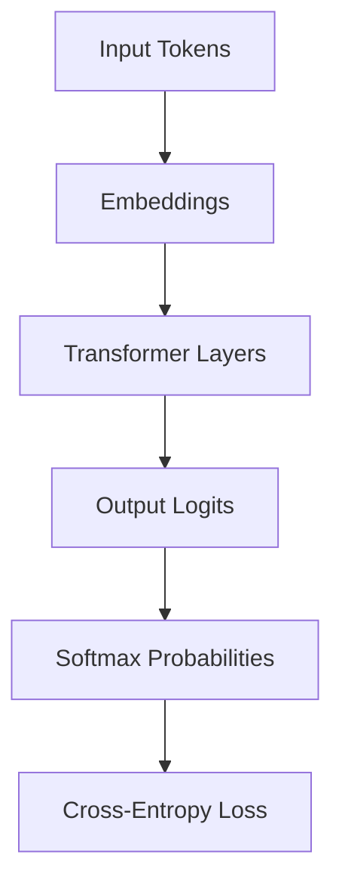
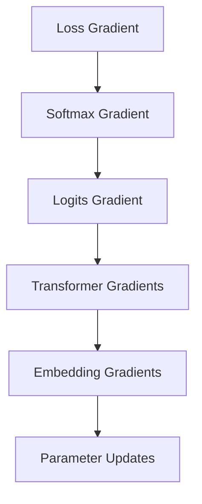
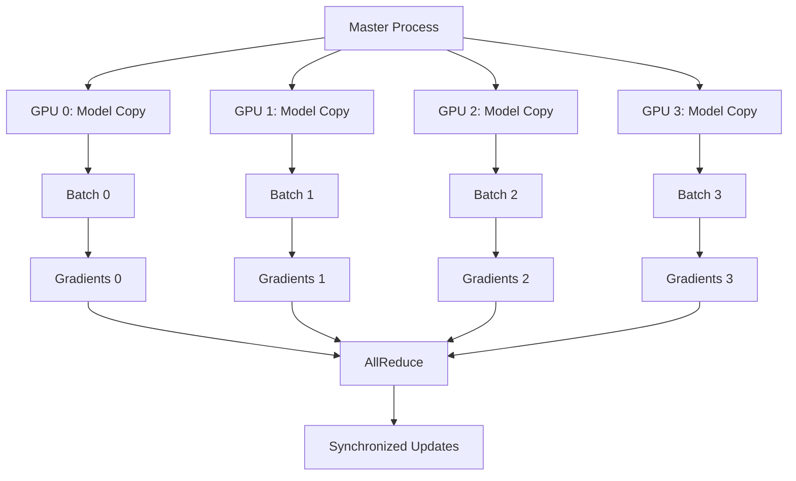

# Training Process Concepts

> **Related Documentation**: [train.py Implementation](../code-analysis/train-py-analysis.md) | [GPT Architecture](gpt-architecture.md) | [Data Pipeline](data-pipeline.md) | [Concept Index](../concept-index.md#training-concepts)

## Introduction

This document explains the fundamental concepts behind training GPT models, covering the language modeling objective, optimization algorithms, and distributed training strategies. Understanding these concepts is essential for effectively training and fine-tuning transformer-based language models.

> **Implementation Note**: For the actual training code implementation, see the [train.py Analysis](../code-analysis/train-py-analysis.md)

## Language Modeling Objective

### Next-Token Prediction

The core task of GPT training is **autoregressive language modeling** - predicting the next token in a sequence given all previous tokens.

#### Mathematical Formulation

For a sequence of tokens `x = [x₁, x₂, ..., xₙ]`, the model learns to maximize:

```
P(x) = ∏ᵢ₌₁ⁿ P(xᵢ | x₁, x₂, ..., xᵢ₋₁)
```

This factorization allows the model to:
1. Learn from every position in every sequence
2. Generate text by sampling from learned distributions
3. Handle variable-length sequences naturally

#### Training vs. Inference

**During Training:**
- Model sees entire sequence at once → *See [Training Loop Implementation](../code-analysis/train-py-analysis.md#training-loop-implementation)*
- Computes loss for all positions simultaneously → *See [Loss Computation](../code-analysis/train-py-analysis.md#loss-calculation)*
- Uses teacher forcing (ground truth previous tokens) → *See [Data Loading](../code-analysis/train-py-analysis.md#data-loading)*

**During Inference:**
- Model generates one token at a time → *See [Text Generation Pipeline](../code-analysis/sample-py-analysis.md#text-generation-pipeline)*
- Uses its own previous predictions → *See [Autoregressive Sampling](../code-analysis/sample-py-analysis.md#generation-loop)*
- Autoregressive generation process → *See [Generation Algorithms](text-generation-algorithms.md#autoregressive-generation)*

### Cross-Entropy Loss

The training objective uses cross-entropy loss between predicted and actual next tokens:

```
Loss = -∑ᵢ₌₁ⁿ log P(xᵢ | x₁, ..., xᵢ₋₁)
```

**Key Properties:**
- Differentiable with respect to model parameters
- Penalizes confident wrong predictions heavily
- Encourages high probability for correct tokens
- Naturally handles vocabulary size scaling

### Perplexity Metric

Perplexity measures how "surprised" the model is by the actual tokens:

```
Perplexity = exp(Loss) = exp(-1/N ∑ᵢ log P(xᵢ | context))
```

**Interpretation:**
- Lower perplexity = better model
- Perplexity of N means model is as confused as random guessing over N tokens
- Typical values: 10-50 for good models on natural text

## Gradient Descent and Optimization

### Backpropagation in Transformers

Training uses backpropagation to compute gradients of the loss with respect to all parameters.

#### Forward Pass Flow



#### Backward Pass Flow



### Gradient Challenges

#### Vanishing Gradients

**Problem**: Gradients become exponentially small in deep networks
**Solutions**:
- Residual connections provide gradient highways
- Layer normalization stabilizes gradient flow
- Careful weight initialization (Xavier/He initialization)

#### Exploding Gradients

**Problem**: Gradients become exponentially large
**Solutions**:
- Gradient clipping (limit gradient norm)
- Learning rate scheduling
- Proper weight initialization

### Optimization Algorithms

#### Adam Optimizer

GPT training typically uses Adam, which combines:
- **Momentum**: Exponential moving average of gradients
- **Adaptive Learning Rates**: Per-parameter learning rate scaling

```
m_t = β₁ * m_{t-1} + (1 - β₁) * g_t
v_t = β₂ * v_{t-1} + (1 - β₂) * g_t²
θ_t = θ_{t-1} - α * m̂_t / (√v̂_t + ε)
```

**Hyperparameters:**
- `β₁ = 0.9`: Momentum decay rate
- `β₂ = 0.999`: Second moment decay rate  
- `α`: Learning rate (typically 1e-4 to 6e-4)
- `ε = 1e-8`: Numerical stability constant

#### AdamW Variant

AdamW decouples weight decay from gradient-based updates:
- Applies weight decay directly to parameters
- Prevents weight decay from affecting adaptive learning rates
- Often achieves better generalization

### Learning Rate Scheduling

#### Warmup Phase

**Purpose**: Gradually increase learning rate from 0 to target value
**Benefits**:
- Prevents early training instability
- Allows model to find good initial direction
- Typical warmup: 2000-10000 steps

#### Cosine Decay

After warmup, learning rate follows cosine schedule:

```
lr(t) = lr_min + (lr_max - lr_min) * (1 + cos(π * t / T)) / 2
```

**Advantages:**
- Smooth decay prevents training oscillations
- Final low learning rate enables fine convergence
- Well-suited for transformer training

#### Linear Decay

Alternative schedule with linear decrease:

```
lr(t) = lr_max * (1 - t / T)
```

## Gradient Accumulation

### Memory Constraints

Large models and batch sizes often exceed GPU memory. Gradient accumulation enables effective large batch training:

#### Standard Training
```
for batch in dataloader:
    loss = model(batch)
    loss.backward()
    optimizer.step()
    optimizer.zero_grad()
```

#### Gradient Accumulation
```
for i, batch in enumerate(dataloader):
    loss = model(batch) / accumulation_steps
    loss.backward()
    
    if (i + 1) % accumulation_steps == 0:
        optimizer.step()
        optimizer.zero_grad()
```

### Effective Batch Size

```
Effective Batch Size = Micro Batch Size × Accumulation Steps × Number of GPUs
```

**Benefits:**
- Enables training with larger effective batch sizes
- Improves gradient estimates and training stability
- Allows training larger models on limited hardware

## Distributed Training Concepts

### Data Parallelism

#### Distributed Data Parallel (DDP)

Each GPU processes different data batches but maintains identical model copies:



#### AllReduce Communication

**Process:**
1. Each GPU computes gradients on its batch
2. AllReduce sums gradients across all GPUs
3. Each GPU receives the averaged gradients
4. All GPUs apply identical parameter updates

**Communication Patterns:**
- Ring AllReduce: O(N) communication complexity
- Tree AllReduce: O(log N) communication complexity
- Bandwidth-optimal for large tensors

### Model Parallelism

#### Tensor Parallelism

Split individual layers across multiple GPUs:
- Attention heads distributed across devices
- MLP layers split by hidden dimensions
- Requires frequent communication during forward/backward passes

#### Pipeline Parallelism

Split model layers across GPUs in sequence:
- Each GPU handles subset of transformer layers
- Forward pass flows through GPUs sequentially
- Backward pass flows in reverse order
- Enables training models larger than single GPU memory

### Mixed Precision Training

#### FP16 Training

Uses 16-bit floating point for most operations:

**Benefits:**
- 2x memory reduction
- Faster computation on modern GPUs
- Enables larger models/batch sizes

**Challenges:**
- Reduced numerical precision
- Gradient underflow in small gradients
- Requires careful loss scaling

#### Automatic Mixed Precision (AMP)

**Loss Scaling:**
```
scaled_loss = loss * scale_factor
scaled_loss.backward()
gradients = gradients / scale_factor
```

**Dynamic Scaling:**
- Automatically adjusts scale factor
- Increases scale when no overflow detected
- Decreases scale when overflow occurs

### Synchronization Strategies

#### Synchronous Training

All GPUs wait for slowest GPU before updating:
- **Pros**: Deterministic training, identical convergence
- **Cons**: Limited by slowest device, potential idle time

#### Asynchronous Training

GPUs update parameters independently:
- **Pros**: No waiting, better hardware utilization
- **Cons**: Stale gradients, convergence challenges

#### Gradient Compression

Reduces communication overhead:
- **Quantization**: Reduce gradient precision
- **Sparsification**: Send only large gradients
- **Error Feedback**: Accumulate compression errors

## Multi-GPU Coordination

### Process Management

#### Process Groups

```python
# Initialize process group
torch.distributed.init_process_group(
    backend='nccl',  # GPU communication backend
    init_method='env://',
    world_size=num_gpus,
    rank=gpu_id
)
```

#### Rank and World Size

- **World Size**: Total number of processes
- **Rank**: Unique identifier for each process (0 to world_size-1)
- **Local Rank**: GPU ID within a single node

### Communication Backends

#### NCCL (NVIDIA Collective Communications Library)

- Optimized for NVIDIA GPUs
- Supports multi-node training
- Efficient AllReduce implementations
- Automatic topology detection

#### Gloo

- CPU-based communication backend
- Cross-platform compatibility
- Fallback when NCCL unavailable

### Fault Tolerance

#### Checkpointing Strategy

```python
# Save checkpoint
checkpoint = {
    'model_state_dict': model.state_dict(),
    'optimizer_state_dict': optimizer.state_dict(),
    'scheduler_state_dict': scheduler.state_dict(),
    'step': current_step,
    'loss': current_loss
}
torch.save(checkpoint, f'checkpoint_{step}.pt')
```

#### Elastic Training

- Automatically handles node failures
- Dynamically adjusts to available resources
- Continues training with different number of GPUs

## Training Stability and Monitoring

### Loss Monitoring

#### Training Curves

Monitor multiple metrics:
- **Training Loss**: Should decrease steadily
- **Validation Loss**: Should track training loss
- **Learning Rate**: Should follow schedule
- **Gradient Norm**: Should remain stable

#### Warning Signs

- **Loss Spikes**: May indicate learning rate too high
- **Loss Plateaus**: May need learning rate adjustment
- **Gradient Explosion**: Requires gradient clipping
- **NaN Values**: Indicates numerical instability

### Debugging Strategies

#### Gradient Analysis

```python
# Monitor gradient norms
total_norm = 0
for p in model.parameters():
    if p.grad is not None:
        param_norm = p.grad.data.norm(2)
        total_norm += param_norm.item() ** 2
total_norm = total_norm ** (1. / 2)
```

#### Activation Analysis

- Monitor activation statistics (mean, std, range)
- Check for dead neurons (always zero activations)
- Verify attention pattern diversity

### Hyperparameter Tuning

#### Critical Hyperparameters

1. **Learning Rate**: Most important, typically 1e-4 to 6e-4
2. **Batch Size**: Larger generally better, limited by memory
3. **Warmup Steps**: Usually 2000-10000 steps
4. **Weight Decay**: Typically 0.01-0.1
5. **Dropout**: Usually 0.0-0.1 for large models

#### Scaling Laws

Empirical relationships for optimal hyperparameters:
- Learning rate scales with batch size: `lr ∝ √batch_size`
- Optimal batch size increases with model size
- Training time scales with compute budget

## Advanced Training Techniques

### Curriculum Learning

Start with easier examples, gradually increase difficulty:
- **Length Curriculum**: Start with shorter sequences
- **Complexity Curriculum**: Start with simpler text
- **Domain Curriculum**: Progress through domains

### Regularization Techniques

#### Dropout

Randomly zero activations during training:
- Prevents overfitting
- Improves generalization
- Typically applied to attention and MLP layers

#### Weight Decay

L2 regularization on model parameters:
- Prevents parameter values from growing too large
- Improves generalization
- Typically 0.01-0.1 coefficient

#### Label Smoothing

Soften target distributions:
```
y_smooth = (1 - α) * y_true + α / vocab_size
```
- Reduces overconfidence
- Improves calibration
- Typical α = 0.1

### Initialization Strategies

#### Xavier/Glorot Initialization

```
W ~ N(0, 2/(fan_in + fan_out))
```

#### He Initialization

```
W ~ N(0, 2/fan_in)
```

#### GPT-Specific Initialization

- Scale attention projection by 1/√num_layers
- Initialize embedding weights with small variance
- Zero-initialize bias terms

## Conclusion

Training GPT models effectively requires understanding the interplay between the language modeling objective, optimization algorithms, and distributed training strategies. Key principles include:

1. **Autoregressive Objective**: Next-token prediction provides rich learning signal
2. **Stable Optimization**: Careful learning rate scheduling and gradient management
3. **Efficient Scaling**: Distributed training enables larger models and datasets
4. **Monitoring and Debugging**: Continuous monitoring prevents training failures

These concepts form the foundation for successfully training large language models and adapting them to specific domains and tasks.